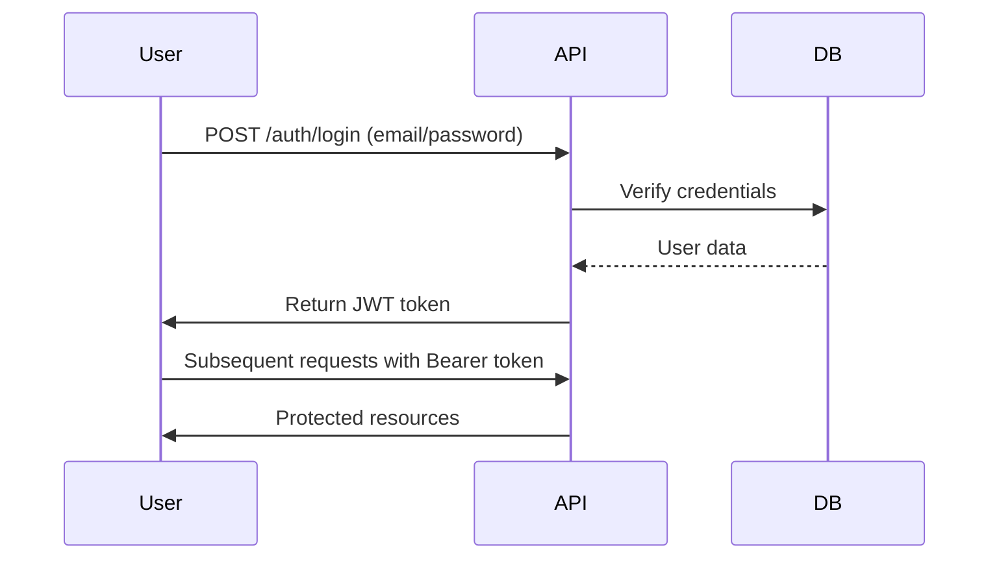

# What's Next? API

[](https://opensource.org/licenses/MIT)
[](https://www.python.org/)
[](https://flask.palletsprojects.com/)

A modern API for managing educational sessions with secure authentication and granular access control. Perfect for schools, bootcamps, and workshop organizers.

## 🌟 Key Features
- **Session Management**  
  Create, read, update, and delete class sessions with:
  - Time slot validation (no overlapping sessions)
  - Multiple session types (Classes, Demos, Q&A)
  - Detailed metadata (title, description, instructor)

- **Smart Scheduling**  
  `GET /api/schedule?date=DD-MM-YYYY` - View daily schedule with automatic time sorting

- **Secure Auth System**  
  - JWT token-based authentication
  - Role-based access control (RBAC)
  - Password hashing with bcrypt

- **Developer Friendly**  
  - Interactive Swagger documentation
  - Docker-ready configuration
  - Comprehensive error handling

## 📚 API Documentation
Explore our interactive API docs powered by Swagger/OpenAPI 3.0:

[](https://app.swaggerhub.com/apis-docs/marifervl/whats-next_api/1.0.0)

```yaml
# Endpoint Highlights from swagger.yaml

/auth/register:
  post: Create new user account

/auth/login:
  post: Generate JWT access token

/api/classes:
  get: List all sessions (public)
  post: Create new session (authenticated)

/api/schedule:
  get: Get daily schedule with time filters
```

## 🚀 Quick Start

### Prerequisites
- Python 3.9+
- PostgreSQL/MariaDB
- Docker (optional)

### Installation
```bash
git clone https://github.com/MariferVL/whats-next-api.git
cd whats-next-api

# Create virtual environment
python3 -m venv venv && source venv/bin/activate

# Install dependencies
pip install -r requirements.txt

# Configure environment
cp env_example .env
```

### Database Setup
```bash
flask db init
flask db migrate
flask db upgrade
```

### Running the API
```bash
# Development
flask run --host=0.0.0.0 --port=5000

# Production (Docker)
docker build -t whatsnext-api .
docker run -dp 5000:5000 --env-file .env whatsnext-api
```

## 🔐 Authentication Flow


## 🗂 Project Structure
```
whats-next-api/
├── app/
│   ├── controllers/       # Business logic handlers
│   ├── routes/            # API endpoint definitions
│   ├── models.py          # Database models
│   ├── utils/             # Helper functions
├── tests/                 # Integration/unit tests
├── Dockerfile             # Container configuration
├── requirements.txt       # Python dependencies
└── swagger.yaml           # OpenAPI specification
```

## 🛡 Security Features
- **JWT Secret Rotation**: Automatically via `token_creator.py`
- **Input Validation**: Strict schema validation for all endpoints
- **Security Headers**: CORS, CSRF, and rate limiting ready
- **RBAC Implementation**:  
  ```python
  @jwt_required()
  def create_class():
      if not current_user.is_professor:
          abort(403, description="Insufficient permissions")
  ```

## 🤝 Contributing
We welcome contributions! Please follow these steps:
1. Fork the repository
2. Create your feature branch (`git checkout -b feature/amazing-feature`)
3. Commit changes with JIRA ticket reference (`[WN-123] Add feature`)
4. Push to branch (`git push origin feature/amazing-feature`)
5. Open a Pull Request

## 📜 License
Distributed under the MIT License. See `LICENSE` for more information.
